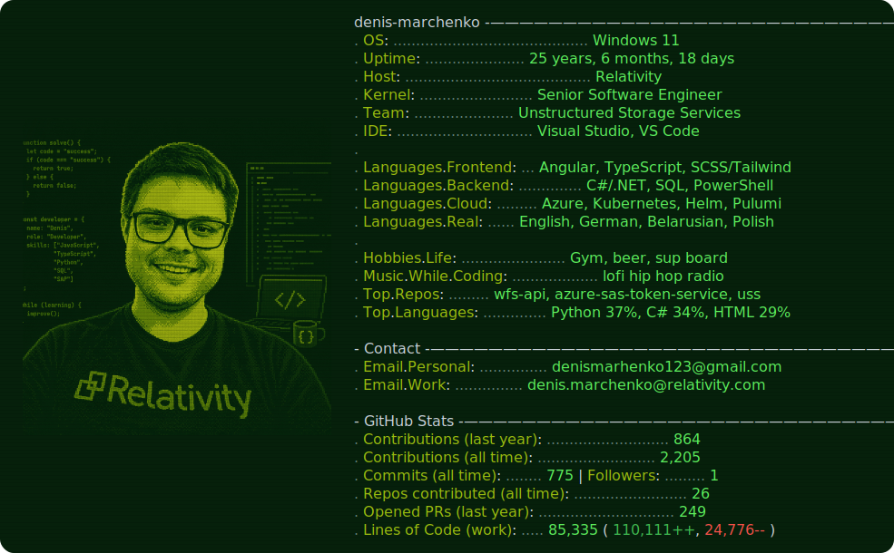

<picture>
  <source media="(prefers-color-scheme: dark)" srcset="./dark_mode.svg">
  <source media="(prefers-color-scheme: light)" srcset="./light_mode.svg">
  
</picture>

<!--
Neofetch-style profile card. The SVGs are regenerated daily by .github/workflows/build.yml,
which runs today.py to refresh the GitHub Stats block (repos, commits, stars, followers, LOC, age).

Setup (one time):
  1. Repo must be named exactly denismarchenkoRelativity (your username) to show on your profile.
  2. Create a classic PAT with scopes: repo, read:user.  Add it as repo secret ACCESS_TOKEN.
  3. Add repo secret USER_NAME = denismarchenkoRelativity.
  4. Actions > "README build" > Run workflow (or wait for the daily cron).

To swap the placeholder photo: replace the <rect>/<text> "DM" block in dark_mode.svg and
light_mode.svg with <image href="data:image/png;base64,...." x="15" y="15" width="350" height="480"/>.
-->
